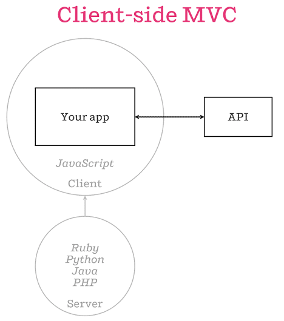
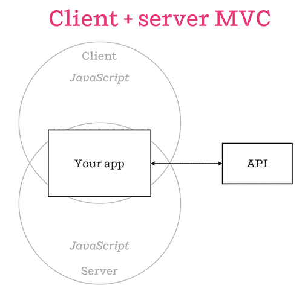

title: Isomorphic JavaScript applications and .NET
author: Charalampos Karypidis (xabikos)
description: An introduction to isomorphic JavaScript application with ASP.NET
date: <%= Date.today %>
% available themes: Default - Sky - Beige - Simple - Serif - Night - Moon - Solarized
theme: simple
% available transitions: // default/cube/page/concave/zoom/linear/fade/none
transition: linear
custom_css: presentation
% code-engine: coderay

!SLIDE
## Isomorphic JavaScript applications and .NET

&nbsp;

&nbsp;

An introduction to isomorphic JavaScript applications with ASP.NET

&nbsp;

&nbsp;

&nbsp;

[Progressive .NET Tutorials 2016](https://skillsmatter.com/conferences/7235-progressive-dot-net-tutorials-2016/) 

!SLIDE
## Who am I?

&nbsp;

<h3>
  Babis Karypidis (<strong>xabikos</strong>)
</h3>

&nbsp;

&nbsp;

  Freelance Software Engineer focusing on .NET, Azure and React.js

&nbsp;

  <a href="http://github.com/xabikos">github.com/xabikos</a>
   
  <a href="http://twitter.com/xabikos">twitter.com/xabikos</a>
   
  <a href="http://xabikos.com">xabikos.com</a>

!SLIDE
## Agenda

&nbsp;

&nbsp;

* What is isomorphic JavaScript appications and which problem they solve

&nbsp;

* Using the mature [Reactjs.net](http://reactjs.net) for rendering [Reactjs](https://facebook.github.io/react/) applications on the server

&nbsp;

* Using the new [JavaScript services](https://github.com/aspnet/JavaScriptServices) project that supports server side rendering for multiple libraries/frameworks

!SLIDE
## What is isomorphic JavaScript appications

&nbsp;

* [Isomorphic JavaScript: The Future of Web Apps](http://nerds.airbnb.com/isomorphic-javascript-future-web-apps/)

   One of the first posts that use the term that is still valid (from airbnb)

&nbsp;

* It's the natural evolution of well known Single Page Applications

&nbsp;

* It's the consequence of JavaScript's tremendous popularity (JavaScript everywhere)

!SLIDE
### Well known Single-Page app

!SLIDE
### Isomorphic client server MVC

!SLIDE
## Issues isomorphic JavaScript appications solve

&nbsp;

* Search engine optimization

&nbsp;

* Improved performance

&nbsp;

* Easier maintenance  

!SLIDE
## Enough with the slides show us some code

!SLIDE
## Available resources

&nbsp;

* [Reactjs.net](http://reactjs.net)
* [JavaScript services](https://github.com/aspnet/JavaScriptServices)
* [Official webpack site](https://webpack.github.io)
